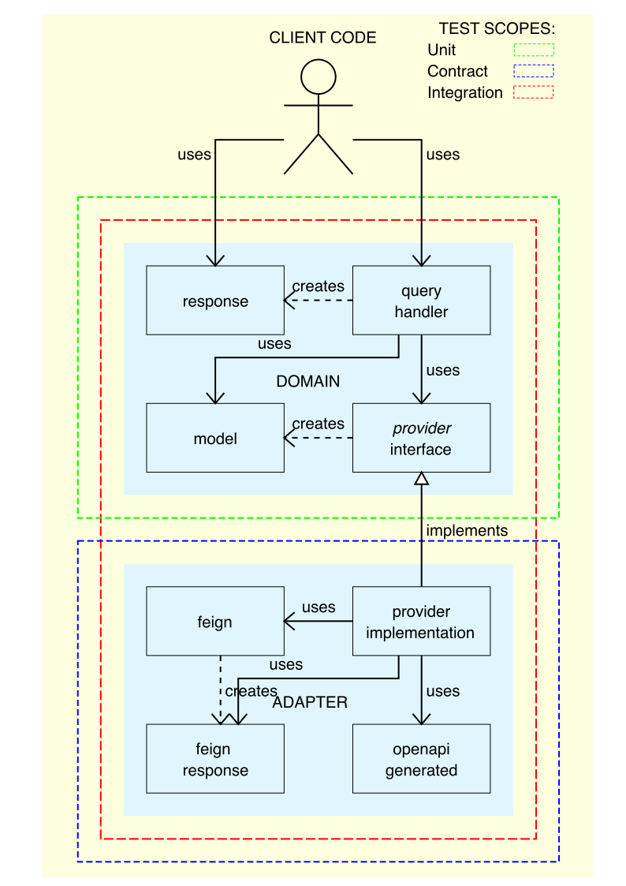

# API fetching weather at ballparks and upcoming games 

This software is written following a request from MLB,
in order to prepare for a job interview for a Java Develper
position at MLB.

## Functionality 

This application serves two use cases:

- Shows current temperature and conditions at a ballpark (by `venue` ID);
- Shows forecasted temperature and conditions of the upcoming game
  (by `team` ID and `date` of the game).

## Solution

What this program does is not much more than simple
orchestration combining response of a couple of HTTP APIs.

Even though there is not much business logic in it right now,
but it might need some extensions or maintenance in the future,
therefore it is good idea to come up with an architecture that
provides separation of concerns and layered architecture.

I separated code which dealing with business use cases stated
with requirements in `handler` classes, which represent business
use cases, and they are not aware of how the data is retrieved
over the network. The `handler` classes are aware of `provider`
service interfaces where the `handlers` fetch their data from.

The `provider` interfaces are still part of the domain model,
but their actual implementations are in the adapter layer.
The adapters are the implementations of the `provider` interfaces.
They are in charge of making calls to the APIs and putting the
data into domain specific models.

The National Weather Service provides an 
[OpenAPI Schema](https://api.weather.gov/openapi.json),
I used it to generate the http client code, so that I could just focus
on mapping the data from the API response to the domain model objects.

The MLB Stats API does not publish OpenAPI schema
(or at least I could not find it anywhere). However,
I wanted to save myself from implementing the HTTP client logic,
therefore I chose to use Feign client. I needed to declare the DTOs
manually. I decided to use **Java Records** instead of POJOs,
which otherwise could be resulting in a lot of code to describe the
shape of the data coming from the API
(even if we use Lombok, Java is still quite verbose).

💡Picocli CLI app module has been introduced,
please use shell script wrapper to run CLI commands:

    ./mlb-weather --team 121  --date 2022-08-23

Or, after adding dependencies `maven-jar-plugin` 
and `spring-boot-maven-plugin`: 

    mvn clean install && \
    java -jar weatherapi/target/weatherapi-0.0.1-SNAPSHOT.jar --venue 17

now is also possible...

So, as I mentioned the UI to this program is JUnit,
the next section of this document is therefore about tests.

## Types of tests

For testing we use JUnit with Surefire 
We have different types of tests in this application:

### Unit tests

They verify that the logic in our domain handlers is correct.
Typically, they have boundary of our business domain mocked.
These tests are not supposed to interact with anything outside the application,
and they are fast to execute.

Use this command to run unit tests:

    mvn -P unit-tests test

### Integration tests

Integration tests ensure that:

- domain handlers
- and data provider adapters

can work together.
Running this suite **does not** use any

- production API or
- ~~production database~~ there is no DB in ths app anyway...

instead they use Wiremock ~~and H2~~.
This suite is supposed to cover most crucial user stories.

Use this command to run integration tests:

    mvn -P integration-tests test

### Contract tests

Contract tests ensure that changes in our codebase
do not break integration with 3rd parties.

These tests only check how data provider adapters work
with different API responses.
Narrow test scope focused on the boundary of our system
should also serve as live  documentation
for integrations with 3rd parties.
These tests use Wiremock heavily.

Use this command to run contract tests:

    mvn -P contract-tests test

### Smoke tests

Smoke tests run use Production configuration
Smoke tests pass if there are no errors and
results are in acceptable range.
(Typically smoke tests don't test exact values,
as the state in Production constantly changes).

The purpose of these tests is to indicate which
functionality is broken on production.

Smoke tests suit are more considered to be monitoring tool,
rather than testing.

And they are supposed to be performed on regular basis.
(As opposed others are performed mostly after some 
changes in our codebase).

Use this command to run smoke tests:

    mvn -P smoke-tests test

To run every single test of any type:

     mvn -P all-tests test

And simply running without profile specified:

    mvn clean test

Will run all unit, integration, and contract tests
(but not smoke tests).

💡You may notice that using `@Nested` it may contain
different types of tests in the same file.

💡Clock is mocked in unit, integration and contact tests
so that it can be "locked" to certain date to make sure
that the fixtures never expire.

### Generate Wiremock fixtures

In order to facilitate development of Wiremock fixtures
you can run a smoke alongside with a stand-alone Wiremock server,
and you can them configured so that:

- the app runs a smoke test while having one of the API URL
  overridden by environment variable to point to the stand-alone
  Wiremock instance;
- Wiremock is set up to act as a proxy, to pass the incoming request
  along to the real URL of that API, while recording
  the request and response to a file.

Later this file can be copied and used as a fixture for
integration or contract test.

1. Start standalone wiremock server with `./run-wiremock.sh` command;
2. Add `@Tag("Wiremock")` on one of the smoke tests;
3. Make sure in the [Wiremock admin](http://localhost:8080/__admin/recorder/)
   you set the *Target URL* it to point to the original URL
   (it is either `https://statsapi.mlb.com` or `https://api.weather.gov`);
4. Run your tagged test with `mvn -P wiremock-stats test` or `mvn -P wiremock-weather test` command;
5. Notice there are fixtures generated in `` directory;

You can copy over the generated fixtures to use with built-in wiremock
in the integration and contract tests.
